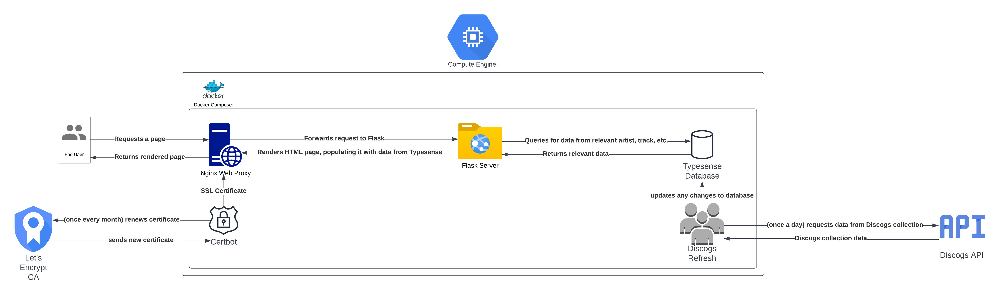

# WKCR Library Catalog

## Overview
WKCR is a student-run radio station with a physical collection of tens of thousands of CDs, Vinyl, and Cassettes. The WKCR Library Catalog is a full-stack web application that presents the items from the library in a searchable catalog and is currently hosted at https://library.wkcr.org. This allows programmers at the station to query items in the library in unconventional ways beyond the department-artist system used to physically arrange the items in the library. This application can be modified to function as a web catalog for any Discogs catalog.


## Architecture
### Docker Containers
At its core, the service consists of five Docker containers defined using [docker-compose](https://docs.docker.com/compose/). The containers run on a Google Cloud [Compute Engine](https://cloud.google.com/compute) instance and are defined in the [compose.yaml](compose.yaml) file.


#### Flask App
The Flask app is the service that generates HTML pages from a template with database data to have consistent release and search pages throughout the site. Defined as `web` in the Docker Compose YAML file, it is built as a custom Docker container rather than an existing Docker image. This container is defined in [app/Dockerfile](app/Dockerfile), which loads the relevant files in the `/app` directory onto a `python:3.10-alpine` image, installs the relevant pip requirements, and starts a [Gunicorn](https://gunicorn.org) server, a production server that allows Flaks servers to run reliably in a production environment (as opposed to the development server that is started on running `python server.py`).

##### File Structure
Within the `/app` directory, files are stored in the following structure:
```
app
|- static
|  |- Logo.jpeg
|  |- main.css
|  ...
|- templates
|  |- home.html
|  |- layout.html
|  |- search.html
|  |- view.html
|- Dockerfile
|- requirements.txt
|- server.py
```

* `static`: Includes static resources such as CSS stylesheets, images to be served, and JavaScript files that are run on the client-side.
  - `main.js` includes the logic for the search and navigation bar while `results.js` includes the logic to render search results.
* `templates`: Includes HTML templates used to render each page using [Jinja](https://jinja.palletsprojects.com/en/3.1.x/) templates.
  - `home.html`: Homepage served at root of website.
  - `layout.html`: Navigation and search bar that is prepended to all other templates.
  - `search.html`: Search page that is populated using `results.js`.
  - `view.html`: View page for individual release (single, EP, album, etc.).
* `Dockerfile`: Defines creation of container as described above.
* `requirements.txt`: Newline separated list of pip requirements necessary to run on new image.
* `server.py`: Defines Flask server that renders the HTML templates, filling them in with data from Typesense.
  - `load_dotenv()` loads the environment variables stored to access the Discogs API. See Running Locally below for more info.
  - `client` is the Typesense Client that makes calls to the Typesense container. Note: The host is listed as `typesense` (`http://typsense:8000`) because of how Docker Compose networks between containers.
  - `requestWrapper()` wraps around Python's HTTP request framework by taking into account Discogs' rate limits.
  - `forView()` packages a database item into a JSON object with the information needed to render the release (album) page.
  - `unflatten()` turns nested objects stored in database back into a nested object as Typesense does not currently support nested objects.
  - Each of the routes retrieves relevant information from the Typesense database and renders the corresponding page. See more information on syntax and structure in [Flask's documentation](https://flask.palletsprojects.com/en/2.3.x/).

##### Integrations
In addition to pulling data from Discogs to populate track listing, artists, etc. the `view.html` template includes a link to [spinitron.com](https://spinitron.com), a site that WKCR uses to log which tracks are played on air and when. It generates a link querying for tracks from that album so users can see when the corresponding album was previously played on air.

#### Typesense Database
All of the data from Discogs is stored in a Typesense database. Typesense was chosen as it is easily searchable with flexible queries by different attributes and typo correction. Unlike the Flask container, this container is built using a pre-existing [Docker image created by Typesense](https://hub.docker.com/r/typesense/typesense).

While it is exposed on port 8100, the GCP firewall is configured so the database is not actually exposed to the public internet. The volume `typesense-data` is created and mapped to the GCP instance's file system so when the Docker Compose is restarted, any data that remains intact.

The Typesense database includes one collection called `collection`. Each release that is catalogued is structured as follows:
* `id`: Discogs' instance ID (ID's are unique to instances within a catalog, so for example if you have two copies of one album in collection, they will have two separate instance ID's and two separate entries in the database)
* `title`: Release title
* `folder`: Which folder this instance is placed. For WKCR we use this field for category based on department and media, for example "Jazz CD"
* `wkcr_location`: Text string from Discogs' notes, generally we use this for the first three letters of however it's sorted, for instance "PAR" for Charlie Parker
  - Note: These fields are appended on the front-end to provide location information within the library, for example "Jazz CD PAR"
* `image`: URL of Discogs cover image
* `artists`: List of structures describing primary artists on release
* `year`: Year release was released
* `labels`: List of structures describing record labels associated with release
* `genres`: List of genres associated with release
* `styles`: List of styles associated with release
* `credits`: List of structures describing additional artists on release
* `tracklist`: List of structures describing tracks on release (name, length, etc.)
* `country`: Country code of where release was released if present
* `notes`: Discogs notes about release if present
* `identifiers`: List of structures describing identifiers (UPC code, etc.)
* `url`: Discogs URL for release

#### Discogs Refresh
As with the Flask server, this container is custom defined in [discogs-update/Dockerfile](discogs-update/Dockerfile). Additionally, [discogs-update/requirements.txt](discogs-update/requirements.txt) lists the pip requirements that are installed on environment creation while the main logic runs from [discogs-update/app.py](discogs-update/app.py).

`app.py` has a similar structure to `server.py` in the Flask container:
* `load_dotenv()` loads the environment variables stored to access the Discogs API. See Running Locally below for more info.
* `client` is the Typesense Client that makes calls to the Typesense container. Note: The host is listed as `typesense` (`http://typsense:8000`) because of how Docker Compose networks between containers.
  - If the Typesense collection has not been initialized yet, it is done so on script runtime.
* `requestWrapper()` wraps around Python's HTTP request framework by taking into account Discogs' rate limits.
* `updateCollection()` is the main logic for the Discogs update. It
  - Creates a new thread to run `updateCollection()` at the following 2AM EST (while this could have been accomplished with a cron job, this would have required additional setup when developing locally as cron jobs often do not behave well within Docker containers. Additionally, this ensures that the collection update occurs immediately when the script is run).
  - Loops through each folder in WKCR's Discogs collection using [Discogs API](https://www.discogs.com/developers).
    * Loops through each release in the folder.
	  - Updates release's notes in Typesense entry if release is present in case WKCR staff update location.
	  - Adds entire release information to Typesense otherwise.

Note: This looping through, while inefficient, is unfortunately necessary as Discogs' API does not provide any functionality to listen for updates or to filter call results by instance creation date or other relevant fields.

#### Nginx Proxy
While the Flask server is sufficient to host the web application (in earlier revisions it was seriving regular traffic on port 80), it does not handle serving newly created static content well, which is necessary for SSL Certificate verification (see Certbot below). 

The Nginx server is defined in the [nginx/app.conf](nginx/app.conf) file: the proxy simply proxies regular traffic, sending it to the Flask server, while any requests at `/.well-known/acme-challenge/` are directed to a static directory. Additionally, all traffic for the web application are redirected to HTTPS to ensure an encrypted connection, while the `Strict-Transport-Security` flag set prevents downgrading attacks where unencrypted HTTP links are injected into a page.

The Docker container holding this server contains five volumes:
- `./nginx`: the `app.conf` file in this repository is mapped to `etc/nginx/conf.d` inside the container as expected by the Nginx image.
- `web_static`: holds the web root for static files served for SSL Certificate verification.
- `certbot-etc` and `certbot-var`: holds Certbot's certificates and direectory, respectively.
- `./dhparam`: holds Diffie-Helman keys for encryption.

#### Certbot/SSL Certificate
Cerbot is used to create a Let's Encrypt SSL Certificate. The verification works by storing a random string in a file at a specified location, while Let's Encrypt validates that the random file is accessible from `library.wkcr.org/.well-known/acme-challenge/` to ensure that the party requesting the certificate actually controls the domain they are attempting to receive a certificate for. 

This Docker container performs this functionality automatically, using the shared volumes `web_static`, `certbot-etc`, and `certbot-var` shared with the Nginx proxy so Certbot can save files that will be served by Nginx. The certificate was set up following this [Digital Ocean tutorial](https://www.digitalocean.com/community/tutorials/how-to-secure-a-containerized-node-js-application-with-nginx-let-s-encrypt-and-docker-compose). 

##### Renewal
As described in the tutorial, the certificate is renewed automatically using a cron job. The renewal script is stored at [ssl_renew.sh](./ssl_renew.sh) As Let's Encrypt certificates expire after 90 days, the renewal occurs monthly. This is run using the following cron job

```0 7 3 * * /home/library/wkcr-catalog/ssl_renew.sh >> /var/log/cron.log 2>&1```

This runs the renewal command every day at 03:00 UTC on the 7th day of every month.

### CI/CD
The CI/CD (continuous integration/continuous deployment) pipeline is run using [Github Workflows](https://docs.github.com/en/actions/using-workflows). It is defined in the [.github/workflows/test-and-deploy.yml](.github/workflows/test-and-deploy.yml) YAML file. Using these pipelines helps to minimize the risk of deployment issues by performing basic integration tests to verify that the commit does not include a major breaking change, automatically deploys the changes to reduce human error, and notifies WKCR to make staff aware of a site change in case of any issues.


#### Github Workflow Structure
As shown in the `on` property, this workflow is triggered on any commits pushed to the main branch. The workflow includes three `jobs` or stages. Each stage is listed as dependent on the previous, ensuring that deployments only occur if the integration tests pass and the Slack message is sent following a deployment.

#### Test Script
This first stage includes four steps:
* Checkout: this step checks out the repository to ensure that the proper files are present in the testing environment.
* Set test env: this step places the Discogs API key managed by a GitHub secret into the correct location to ensure the test server has the correct credentials.
* Set refresh test env: this step places the Discogs API key managed by a GitHub secret into the correct location to ensure the Discogs refresh container has the correct credentials.
* Run test script: this step runs the script stored at [test/test.sh](test/test.sh). This script
  - Runs the Docker Compose command to build out the service in the test environment.
  - Waits 15 seconds so all of the services have time to start and the Discogs refresh container has time to pull some of the data into Typesense.
  - Runs the Python [test/test.py](test/test.py) script:
    * While not comprehensive, this script runs basic integration tests for both the main homepage and a search page to demonstrate that the Flask server runs correctly, that the Typesense server starts up and has collections properly set up, and that the Flask server properly connects to the Typesense server on boot.
  - Prints the logs of the Flask server for debugging purposes should the tests fail.
  - Cleans up the Docker Compose.
  - Returns success/fail dependent on the results of the script.

#### Auto-Deployment
Using GCP's existing workflows and IAM roles, the deployment occurs in two steps:
* Authenticate: this step authenticates with GCP to verify that it is allowed to SSH into the instance.
* SSH and run commands on the instance: in this step, it
  - Pulls the latest commit onto the instance.
  - Runs Docker Compose to recreate the container, leading to roughly 10 seconds of downtime.

#### Slack Notification
In this single step, it utilizes Slack webhooks to send a message to WKCR staff alerting them that the website has been updated. It includes the commit message, a link to the commit's diff, and a link to the website to easily navigate to the website to check that it is running.

## Running Locally
To run the catalog locally,
* Install [Docker](https://www.docker.com) on your computer.
* Clone this repository by running `git clone git@github.com:jkapilian/wkcr-catalog.git` in the directory of your choosing.
* Place two files into the `app/` and `discogs-update/` directories entitled `.env`.
  - Include the text `DISCOGS_API_KEY=<YOUR_API_KEY>` into the file.
  - While not ideal to have two duplicate environment files, `python-dotenv` does not handle environment files not in the same directory well.
* Run `docker compose up --build --force-recreate -d` to build the service and to update new changes.
* Navigate to http://localhost:8080 to access the locally running site.
* Note: as SSL certificates are not be stored locally, both `webproxy` and `cerbot` will exit.
  - If you are attempting to run this on another remote machine, you will need to generate certificates and Diffie-Helman keys, store them in the proper locations on the remote machine, and update the proper configuration files to reflect the domain you are running the server on. Follow the [Digital Ocean tutorial](https://www.digitalocean.com/community/tutorials/how-to-secure-a-containerized-node-js-application-with-nginx-let-s-encrypt-and-docker-compose) used to setup SSL for this service for more information.

## Future Improvements
* Development/testing stages: As the Nginx server redirects all traffic to HTTPS, there is currently no way to develop or test the Nginx server locally. In the future, creating different stages that configure the server differently could help ease the development process as well as include integration tests that verify the Nginx proxy's functionality.
* More in-depth testing: Currently, the tests simply verify a `200 OK` response code on the catalog's homepage and search page, but more in-depth testing, such as ensuring certain elements are rendered correctly (for example, search term X should have at least one result), testing breaking scenarios, and including unit tests in addition to these full integration tests, could help ensure safer development.
* Hotswap deployment: As the automatic deployment process simply involves pulling the new commit and re-running Docker Compose, some downtime is introduced. Migrating to other GCP services that leverage the containerized nature of the service could help to eliminate this downtime.
* CAS Authentication/Account Management: One planned improvement is the introduction of CAS using Columbia's [CAS Server](https://www.cuit.columbia.edu/cas-authentication#!/%23cu_accordion_item-14242) to limit access to certain aspects of the website to WKCR members.
* Analytics: Utilizing Google Analytics or similar services could help to monitor how often the catalog is used, what types of searches are most popular, etc.
* Full CRUD (Create, Read, Update, Delate) functionality: With the addition of an account system, full CRUD functionality could be introduced, allowing certain priviliged users to edit the database which could percolate to the underlying Discogs collection using their other API calls.